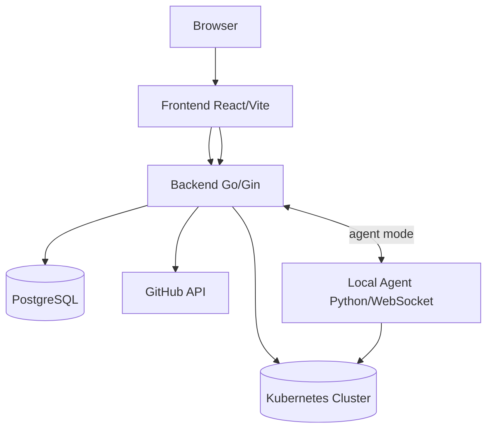

# A Repository-Centric Static Analysis Framework For Detecting Kubernetes Security Misconfigurations

Aegios is a Kubernetes security workflow platform with:
- A React/Vite frontend (`aegios-control-center-main`)
- A Go/Gin backend (`github-pat-backend`)
- A PostgreSQL data layer (via `docker-compose.yml`)

This README documents the current implementation and real request flow in this repository.

## What the platform does
1. Authenticates users with GitHub username + PAT.
2. Syncs repositories and tracks Kubernetes-related files.
3. Renders Helm charts into concrete Kubernetes resources.
4. Runs validation checks and stores findings.
5. Computes score, posture, and action views from findings.
6. Executes remediation through terminal integration (direct mode or remote agent mode).
7. Optionally opens GitHub pull requests with suggested fixes.

## High-level architecture


## Repository map
```text
.
|-- aegios-control-center-main/      # Frontend app
|   |-- src/contexts/                # Auth + security data lifecycle
|   |-- src/pages/                   # Dashboard/auth/security routes
|   |-- src/components/security/     # Score/posture/actions/terminal UI
|   |-- src/lib/                     # Session token + transformer helpers
|   `-- Dockerfile
|-- github-pat-backend/              # Backend API gateway + services
|   |-- services/authentication/     # signup/login/signout
|   |-- services/fetching-service/   # GitHub fetch + Helm render ingestion
|   |-- services/security-service/   # validation/score/posture/actions/PR
|   |-- services/kube-agent-service/ # session/token/websocket terminal flows
|   |-- pkg/database/                # schema + db access helpers
|   |-- pkg/github/                  # GitHub REST client for branch/PR ops
|   |-- pkg/bedrock/                 # Bedrock remediation client
|   `-- Dockerfile
|-- docker-compose.yml
`-- README.md
```

## End-to-end workflow (actual code flow)

### 1) Authentication
- Frontend routes:
  - `/authentication/signup`
  - `/authentication/login`
- Backend endpoints:
  - `POST /authentication/signup`
  - `POST /authentication/login`
  - `POST /authentication/signout`
- Behavior:
  - Signup validates `github_username + PAT` against GitHub API.
  - Password is bcrypt-hashed.
  - Login creates a DB-backed `user_sessions` token (24h).
  - Frontend stores token in `localStorage` (`aegios_session_token`).

### 2) Repository fetch and file tracking
- Triggered from dashboard `Fetch Data` button.
- Endpoint: `POST /fetching-service/fetch-data` (optimized path).
- Behavior:
  - Validates session token.
  - Reads encrypted PAT from DB and fetches repos from GitHub (GraphQL first, REST fallback).
  - Inserts/updates `github_repository` and `github_files` metadata.
  - Uses commit SHA/time/hash comparison for incremental behavior.
  - First-time fetch limits tracked commit metadata (implementation limit).

### 3) Helm rendering and Kubernetes resource ingestion
- Triggered from dashboard `Render` button.
- Endpoint: `POST /fetching-service/rendering`.
- Behavior:
  - Reads first repository for the org (`LIMIT 1` behavior).
  - Pulls `Helm/*` files from GitHub.
  - Expects chart/value structure:
    - `Helm/charts/<chart>/...`
    - `Helm/environments/dummy-tenant/values-*.yaml`
  - Executes `helm template` per values file.
  - Parses rendered YAML docs, converts to JSON, upserts into `kubernetes_resource`.

### 4) Validation and finding generation
- Triggered from `K8s Score` page `Run Validation`.
- Endpoint: `POST /security-service/validate-namespaces`.
- Behavior:
  - Loads `kubernetes_resource` per org.
  - Required kind checks per namespace.
  - Security checks currently include:
    - Resource misconfiguration
    - Secret misconfiguration
    - Container security
    - Service exposure
    - Network policy openness
    - RBAC over-permission
  - Writes findings into `findings`.

### 5) Score, posture, and actions views
- Endpoints:
  - `POST /security-service/k8s-score`
  - `POST /security-service/k8s-posture`
  - `POST /security-service/k8s-posture-findings`
  - `POST /security-service/k8s-action`
- Frontend behavior:
  - Security pages call `refreshData()` from `SecurityContext`.
  - Category pages primarily use findings (`k8s-posture-findings`) to build cards.
  - Score is findings-driven (no findings means score payload indicates no validation data).

### 6) Agentic remediation and terminal execution
- AI remediation endpoint: `POST /security-service/k8s-agentic`.
- It generates remediation output, stores command/config to `agent_output`, and supports finding/resource IDs.
- Terminal execution endpoint: `POST /session/take-action`.
  - `finding_id` mode: lookup command, create `remediation_executions`, execute via WS agent or direct fallback.
  - Legacy mode: token + command queue.
- Status polling endpoint: `GET /session/remediation-status?execution_id=...`.

### 7) Terminal session lifecycle (Phase 2/3 flow)
1. Frontend calls `POST /session/init` with context name.
2. Backend returns `curl` command for `/session/agent-script-v2` and a short-lived in-memory token.
3. User runs command locally (extracts kubeconfig).
4. Frontend uploads file to `POST /api/upload-config` with Bearer token.
5. Backend activates config and returns long-lived session token.
6. Frontend opens `ws://.../session/ws?token=...`.
7. Backend auto-selects:
   - Direct mode: backend can reach cluster with uploaded kubeconfig.
   - Agent mode: bridge browser terminal to local Python WS agent (`/session/agent-ws`).

## GitHub PR flow
- List branches: `POST /security-service/list-branches`
- Raise PR: `POST /security-service/raise-pr`
- Backend creates fix branch, commits provided YAML content, and opens PR against selected base branch.

## Database tables created at startup
- `organization`
- `github_credentials`
- `user_sessions`
- `github_repository`
- `github_files`
- `kubernetes_resource`
- `findings`
- `config_credentials`
- `agent_output`
- `remediation_executions`

## Run the project

### Option A: Docker Compose (recommended)
```bash
docker compose up --build -d
```

Services:
- Frontend: `http://localhost:8082`
- Backend: `http://localhost:8080`
- Postgres: `localhost:5433`

### Option B: Manual run
1. Start DB:
```bash
docker compose up db -d
```

2. Run backend:
```bash
cd github-pat-backend
go mod tidy
go run main.go
```

3. Run frontend (note port):
```bash
cd aegios-control-center-main
npm ci
npm run dev -- --host :: --port 8081
```

Note: `vite.config.ts` defaults to port `8080`, which conflicts with backend default `8080` unless overridden.

## Environment variables

### Backend (`github-pat-backend/.env`)
Required for core run:
- `DB_HOST`
- `DB_PORT`
- `DB_USER`
- `DB_PASSWORD`
- `DB_NAME`
- `PORT` (default `8080`)
- `FRONTEND_URL` (default `http://localhost:8081`)

Optional:
- `ALLOWED_EXTENSIONS` (comma-separated file extensions for fetch filtering)
- `AWS_ACCESS_KEY_ID`
- `AWS_SECRET_ACCESS_KEY`
- `AWS_REGION` (default `ap-south-1`)

### Frontend (`aegios-control-center-main/.env`)
- `VITE_API_BASE_URL` (for example `http://localhost:8080`)
- `VITE_ENABLE_MOCK_DATA` (`true|false`)

## Known implementation notes
- Helm rendering and PR client use the first repo for an org (`LIMIT 1`).
- Validation findings are regenerated per validation run.
- CORS currently allows all origins (`*`) in backend middleware.
- Bedrock call failures currently fall back to simulated remediation behavior.
- Terminal script files are served from backend endpoints; there is no separate `kube-connect-script/` folder in this repo.

## Recommended usage sequence
1. Signup and login.
2. Click `Fetch Data` on dashboard.
3. Click `Render` on dashboard.
4. Open `K8s Score` and run `Validation`.
5. Review `K8s Posture` and `K8s Actions` categories.
6. Connect terminal agent from dashboard or terminal page.
7. Use `Take Action` or `Remediate` and monitor execution status.